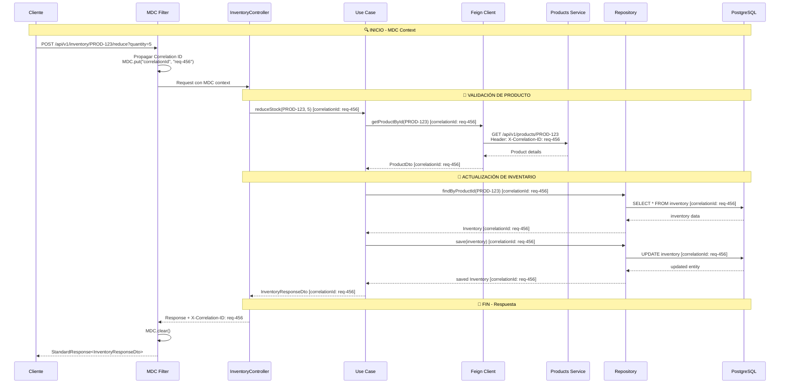

# Inventory Management Microservice

## Descripción

Microservicio para la gestión de inventarios desarrollado como parte del desafío técnico de Linktic. Este servicio proporciona operaciones para gestionar el stock de productos, integrado con el microservicio de productos mediante Feign Client y siguiendo principios de arquitectura hexagonal.

## 🏗️ Arquitectura

### Estructura de Tres Capas

```
src/main/java/com/linktic/challenge/inventories/
├── application/          # Capa de Aplicación
│   ├── dto/             # Objetos de Transferencia de Datos
│   ├── usecase/         # Casos de Uso (Query y Command)
│   └── mapper/          # Mapeadores
├── domain/              # Capa de Dominio
│   ├── model/           # Entidades y Value Objects
│   ├── port/            # Puertos (Interfaces)
│   └── exception/       # Excepciones de Dominio
└── infrastructure/      # Capa de Infraestructura
    ├── adapter/         # Adaptadores
    ├── persistence/     # Persistencia
    ├── web/             # Controladores REST
    ├── feign/           # Cliente Feign para Products
    └── config/          # Configuraciones
```

### Módulo Shared (Librería Interna)

```
shared/
├── constants/           # Constantes globales
├── exception/           # Excepciones compartidas
├── filter/             # Filtros HTTP (MDC, Correlation ID)
├── response/           # Estructuras de respuesta estandarizadas
└── util/               # Utilidades comunes
```

## 🚀 Instalación y Ejecución

### Prerrequisitos

- Java 21
- Docker y Docker Compose
- Gradle 7.6+
- Microservicio de Products ejecutándose (puerto 9091)

### Ejecución con Docker Compose

1. **Clonar el repositorio**
   ```bash
   git clone <repository-url>
   cd inventory-microservice
   ```

2. **Ejecutar la aplicación**
   ```bash
   docker-compose up -d
   ```

3. **Verificar servicios**
    - **Aplicación**: http://localhost:9099
    - **Documentación API**: http://localhost:9099/swagger-ui.html
    - **PgAdmin**: http://localhost:8081 (admin@inventories.com/admin)
    - **Base de datos**: PostgreSQL en localhost:5433

### Ejecución Local

1. **Iniciar base de datos**
   ```bash
   docker-compose up postgres -d
   ```

2. **Asegurar que Products microservice esté ejecutándose**
   ```bash
   # En otro terminal, ejecutar products microservice en puerto 9091
   ```

3. **Compilar y ejecutar**
   ```bash
   ./gradlew clean build
   ./gradlew bootRun
   ```

## 🔧 Configuración

### Variables de Entorno

```yaml
# application.yml
server:
  port: 9099

spring:
  datasource:
    url: jdbc:postgresql://localhost:5433/inventories_db
    username: postgres
    password: postgres
  jpa:
    hibernate:
      ddl-auto: validate
    show-sql: true

# Configuración Feign Client para Products Microservice
feign:
  client:
    config:
      products-client:
        url: http://localhost:9091
        connect-timeout: 5000
        read-timeout: 10000

logging:
  level:
    com.linktic.challenge: DEBUG
    com.linktic.challenge.inventories.infrastructure.feign: DEBUG
  pattern:
    console: "%d{yyyy-MM-dd HH:mm:ss.SSS} [%X{correlationId:-}] %-5level %logger{36} - %msg%n"
```

## 📊 Cobertura de Pruebas

El proyecto mantiene una cobertura de pruebas del **90%+**, verificada con JaCoCo y SonarQube.

```bash
# Ejecutar pruebas y generar reporte
./gradlew clean test jacocoTestReport

# Ver reporte HTML
open build/reports/jacoco/test/html/index.html
```

## 🎯 Decisiones Técnicas

### 1. Arquitectura Hexagonal (Ports & Adapters)
**Justificación**: Separación clara entre lógica de negocio y detalles de infraestructura, facilitando testing y mantenimiento.

### 2. CQRS (Command Query Responsibility Segregation)
**Justificación**:
- Separación clara entre operaciones de lectura (Query) y escritura (Command)
- Optimización independiente para consultas y comandos
- Mejor escalabilidad

### 3. **Feign Client para Integración**
**Implementación**:
- Cliente declarativo para comunicación HTTP con Products microservice
- Configuración de timeouts y retry policies
- Manejo centralizado de errores de integración

**Configuración Feign**:
```java
@FeignClient(name = "products-client", url = "${feign.client.config.products-client.url}")
public interface ProductsFeignClient {
    
    @GetMapping("/api/v1/products/{productId}")
    StandardResponse<ProductDto> getProductById(@PathVariable String productId);
}
```

### 4. **MDC (Mapped Diagnostic Context) y Correlation ID**
**Implementación**:
- Filtro HTTP para propagar Correlation ID entre microservicios
- Contexto de trazabilidad distribuida en logs
- Headers personalizados para tracking cross-service

**Ventajas del MDC**:
- ✅ **Trazabilidad distribuida**: Seguimiento de requests a través de múltiples microservicios
- ✅ **Debugging simplificado**: Filtrado de logs por correlationId across services
- ✅ **Monitoreo end-to-end**: Agrupación de logs por transacción distribuida
- ✅ **Performance**: Bajo impacto en el rendimiento

### 5. Tecnologías Seleccionadas
- **Spring Boot 3.4.0**: Versión estable con soporte extendido
- **Spring Cloud OpenFeign**: Para comunicación entre microservicios
- **Java 21**: LTS con features modernas
- **PostgreSQL**: Base de datos relacional robusta
- **MapStruct**: Mapeo type-safe y eficiente
- **TestContainers**: Pruebas de integración realistas
- **MDC**: Para logging contextual y trazabilidad distribuida

## 🌐 API Endpoints

### Base URL
```
http://localhost:9099/api/v1/inventory
```

### Endpoints Disponibles

| Método | Endpoint | Descripción | Parámetros |
|--------|----------|-------------|------------|
| **GET** | `/api/v1/inventory/{productId}` | Consultar inventario por productId | `productId` (path) |
| **POST** | `/api/v1/inventory/{productId}/reduce` | Reducir stock | `productId` (path), `quantity` (query) |
| **POST** | `/api/v1/inventory/{productId}/increase` | Aumentar stock | `productId` (path), `quantity` (query) |
| **PATCH** | `/api/v1/inventory/{productId}` | Actualizar stock con cambio | `productId` (path), `quantityChange` (query) |

### Parámetros de Query

| Parámetro | Tipo | Descripción |
|-----------|------|-------------|
| `quantity` | Integer | Cantidad a reducir/aumentar (debe ser > 0) |
| `quantityChange` | Integer | Cambio en stock (puede ser positivo o negativo) |

### Ejemplos de Uso

```bash
# Consultar inventario
curl -X GET "http://localhost:9099/api/v1/inventory/PROD-123" \
  -H "X-Correlation-ID: my-correlation-123"

# Reducir stock
curl -X POST "http://localhost:9099/api/v1/inventory/PROD-123/reduce?quantity=5" \
  -H "X-Correlation-ID: my-correlation-123"

# Aumentar stock
curl -X POST "http://localhost:9099/api/v1/inventory/PROD-123/increase?quantity=10" \
  -H "X-Correlation-ID: my-correlation-123"

# Actualizar stock con cambio
curl -X PATCH "http://localhost:9099/api/v1/inventory/PROD-123?quantityChange=-3" \
  -H "X-Correlation-ID: my-correlation-123"
```

## 🔄 Diagrama de Interacción con Feign Client y MDC



## 🔍 Ejemplo de Logs con MDC y Feign

```log
# Request entrante al Inventory Service
2024-01-15 10:30:00.123 INFO [req-456] - Received POST request to /api/v1/inventory/PROD-123/reduce?quantity=5

# Llamada Feign Client a Products Service
2024-01-15 10:30:00.456 DEBUG [req-456] - Feign call to products-service: GET /api/v1/products/PROD-123

# Response desde Products Service
2024-01-15 10:30:00.789 DEBUG [req-456] - Feign response received: 200 OK

# Actualización de base de datos
2024-01-15 10:30:01.123 DEBUG [req-456] - Updating inventory for product PROD-123, reduction: 5 units

# Response exitoso
2024-01-15 10:30:01.456 INFO [req-456] - Returning 200 OK - Stock reduced successfully
```

## 📋 Estructura de Respuesta

### Respuesta Exitosa
```json
{
  "status": "200",
  "message": "Stock reducido exitosamente",
  "data": {
    "productId": "PROD-123",
    "productName": "Laptop Gaming",
    "currentStock": 45,
    "reservedStock": 2,
    "availableStock": 43,
    "lastUpdated": "2024-01-15T10:30:01.456Z"
  },
  "timestamp": "2024-01-15T10:30:01.456Z"
}
```

### Respuesta de Error (Producto no encontrado)
```json
{
  "status": "404",
  "message": "No se pudo completar la operación",
  "errors": [
    {
      "code": "PRODUCT_NOT_FOUND",
      "title": "Producto no encontrado",
      "detail": "No se encontró el producto con ID: PROD-999"
    }
  ],
  "timestamp": "2024-01-15T10:30:01.123Z",
  "correlationId": "req-456"
}
```

### Respuesta de Error (Stock insuficiente)
```json
{
  "status": "422",
  "message": "No se pudo completar la operación",
  "errors": [
    {
      "code": "INSUFFICIENT_STOCK",
      "title": "Stock insuficiente",
      "detail": "No hay suficiente stock disponible. Stock actual: 10, solicitado: 15"
    }
  ],
  "timestamp": "2024-01-15T10:30:01.123Z",
  "correlationId": "req-456"
}
```

## 🧪 Testing

### Pruebas Unitarias e Integración

```bash
# Ejecutar todas las pruebas
./gradlew test

# Ejecutar con cobertura
./gradlew jacocoTestReport

# Ejecutar pruebas de integración
./gradlew integrationTest

# Verificar calidad de código con Sonar
./gradlew sonar
```

### Testing con Feign Client Mock

```java
@Test
void shouldReduceStockWhenProductExists() {
    // Given
    String productId = "PROD-123";
    Integer quantity = 5;
    
    // Mock Feign Client response
    given(productsFeignClient.getProductById(productId))
        .willReturn(StandardResponses.retrieved(productDto, "Product found"));
    
    // When & Then
    assertThatCode(() -> inventoryCommandUseCase.reduceStock(productId, quantity))
        .doesNotThrowAnyException();
}
```

### Testing con MDC

```java
@Test
void shouldPropagateMDCContextInFeignCalls() {
    // Given
    String correlationId = "test-correlation-456";
    MDC.put("correlationId", correlationId);
    
    // When - Realizar llamada Feign
    // Then - Verificar que el header X-Correlation-ID se propaga
    verify(feignClient).getProductById(eq("PROD-123"), 
        argThat(headers -> headers.containsKey("X-Correlation-ID")));
}
```

## 📦 Build

```bash
# Build completo con pruebas
./gradlew clean build

# Build sin pruebas
./gradlew clean build -x test

# Generar reporte Sonar
./gradlew sonar

# Análisis de dependencias
./gradlew dependencyUpdates
```

## 🔧 Configuración de Desarrollo

### Configuración Feign para Desarrollo

```yaml
feign:
  client:
    config:
      products-client:
        url: http://localhost:9091
        logger-level: full
        connect-timeout: 5000
        read-timeout: 10000
        retry:
          max-attempts: 3
          backoff-delay: 1000
```

### Headers de Trazabilidad

- **X-Correlation-ID**: Identificador único de transacción (propagado automáticamente)
- **X-User-ID**: Identificador de usuario (opcional)
- **X-Service-Name**: Inventory-service (automático)

## 🛠️ Desarrollo

### Estructura de Commits
- `feat`: Nueva funcionalidad
- `fix`: Corrección de bugs
- `docs`: Documentación
- `test`: Pruebas
- `refactor`: Refactorización
- `chore`: Tareas de mantenimiento

### Code Style
El proyecto sigue Google Java Style Guide con adaptaciones para Spring Boot y prácticas modernas de microservicios.

## 📊 Monitoreo y Observabilidad

### Métricas Clave
- **Trazabilidad distribuida**: 100% de requests con Correlation ID propagado
- **Logs estructurados**: Con MDC para filtering cross-service
- **Tiempo de respuesta**: Incluyendo llamadas Feign
- **Rate de errores**: Por tipo y servicio origen

### Health Checks
```
GET http://localhost:9099/actuator/health
GET http://localhost:9099/actuator/metrics
GET http://localhost:9099/actuator/info
```

## 📄 Licencia

Este proyecto es desarrollado como parte del desafío técnico de Linktic.